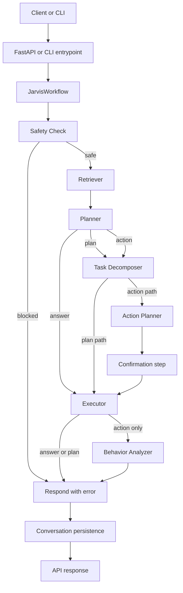

# JARVIS AI Second Brain: Full Project Explanation

## 1. Purpose of This Document

This document explains the complete working of the project in developer-facing detail. It is intended to serve as the single reference for understanding:

- what the project is trying to do,
- how a request moves through the system,
- how each module is implemented,
- what each important class and function does,
- how memory, tools, APIs, and Azure services fit together,
- where the current architecture is strong,
- and where the current implementation still has gaps or inconsistencies.

This explanation is based on the current codebase, not on an idealized design.

## 2. Project Summary

JARVIS is a multi-agent personal knowledge manager built around a staged AI pipeline. The system accepts a user request, validates it, retrieves relevant context from memory, decides what kind of response is needed, optionally decomposes the work into tasks and tool actions, executes the response, learns simple interaction patterns, and returns a final result.

At a high level, the project combines:

- FastAPI for the external API layer,
- LangGraph for the current orchestration graph,
- SQLAlchemy async ORM for structured memory,
- Azure AI Search or a local in-memory fallback for vector-style retrieval,
- Azure OpenAI for planning, decomposition, action design, embeddings, and answer generation,
- a small toolbox of action tools such as email, SMS, reminders, WhatsApp, and habit logging.

The project also contains a legacy sequential orchestrator that mirrors the new graph-based pipeline.

## 3. System Architecture

### 3.1 High-Level Architecture

### 3.2 Main Architectural Layers

The code is organized into the following major layers:

- Entry and hosting layer: server startup, CLI startup, telemetry bootstrapping.
- API layer: authentication, document upload, query endpoint, task and reminder endpoints, habit endpoints, conversation history endpoints.
- Workflow/orchestration layer: LangGraph pipeline and an older sequential orchestrator.
- Agent layer: retriever, planner, task decomposer, action planner, executor.
- State layer: typed shared state passed between all pipeline stages.
- Memory layer: structured storage and vector storage plus a manager that unifies both.
- Tool layer: tool registry plus side-effect tools.
- Utility layer: configuration, logging, Azure service factories, telemetry.
- Learning layer: lightweight behavior analysis after execution.
- Safety layer: input sanitization, injection detection, and rate limiting.

## 4. End-to-End Request Lifecycle

### 4.1 Normal Query Flow

For a normal request through `POST /knowledge/query`, the system behaves like this:

1. The API receives a `QueryRequest` with `query` and optional `session_id`.
2. `get_current_user()` extracts the user identity from the bearer token or uses the debug fallback user.
3. The endpoint calls `workflow.run(...)` on the shared `JarvisWorkflow` instance.
4. `JarvisWorkflow.run()` creates a fresh `AgentState` using `create_initial_state()`.
5. The LangGraph app invokes nodes in sequence or via conditional routing.
6. `run_safety_check()` sanitizes the input, validates size, checks prompt injection patterns, and enforces a per-user rate limit.
7. `RetrieverAgent.retrieve()` expands the query, pulls structured user data, retrieves knowledge chunks, and assembles memory context.
8. `PlannerAgent.plan()` classifies the request into reasoning, planning, or action and produces strategy JSON.
9. `TaskDecomposer.decompose()` converts the planner strategy into one or more tasks.
10. `ActionPlanner.plan_actions()` either creates a no-tool action or produces tool instructions for side-effect actions.
11. The confirmation node auto-confirms side-effect actions because a real confirmation UI is not implemented yet.
12. `ExecutorAgent.execute()` either generates text or executes tool calls through the toolbox.
13. `BehaviorAnalyzer.analyze()` extracts lightweight behavior patterns for action requests.
14. The response node persists the user and assistant messages.
15. `JarvisWorkflow._build_response()` converts final state into the API response shape.

### 4.2 Branching Logic

The planner decides the route:

- `decision = answer`: the system skips task execution planning and goes directly to execution for text generation.
- `decision = plan`: the system decomposes tasks, but it still ends in a text response rather than side-effect tools.
- `decision = action`: the system decomposes tasks, plans tool actions, optionally confirms them, executes them, then runs the learning layer.

### 4.3 Failure and Error Behavior

The workflow is designed to degrade rather than crash:

- If safety fails, the pipeline short-circuits and responds immediately.
- If retrieval fails, logs are added and downstream logic continues with reduced context.
- If planning fails, the workflow injects a fallback planner output with `decision = answer`.
- If task decomposition or action planning fails, downstream steps can still run using fallback tasks or no-op actions.
- If the LLM is unavailable, multiple agents return default or degraded behavior.
- If Azure services are unavailable, local fallbacks are used for vector storage and retrieval.

## 5. Entry Points and Boot Process

### 5.1 Root File: `main.py`

This file is the application entrypoint.

Important functions:

- `start_server()`
  - Starts the FastAPI app using `uvicorn.run("api.api_server:app", ...)`.
  - Pulls host, port, debug, and log level from settings.
- `interactive_cli()`
  - Builds the workflow directly.
  - Initializes it.
  - Runs a terminal loop for manual testing without FastAPI.
  - Prints response text, used tools, detected patterns, and latency.
- `main()`
  - Parses `--cli`.
  - Prints a startup banner.
  - Logs which Azure services are configured.
  - Starts either the server path or CLI path.

Design note:

- Telemetry is configured at import time through `configure_telemetry()`.
- This means startup side effects happen as soon as the module loads.

## 6. API Layer

### 6.1 File: `api/api_server.py`

This file hosts the entire FastAPI application, request models, authentication helpers, endpoint handlers, and a global exception handler.

### 6.2 Application Lifecycle

Important global objects and functions:

- `workflow: Optional[JarvisWorkflow] = None`
  - Shared singleton-like workflow instance for the running API process.
- `lifespan(app)`
  - Creates the workflow during startup.
  - Calls `await workflow.initialize()`.
  - Shuts down the workflow on application shutdown.

### 6.3 Authentication Helpers

Important functions:

- `_create_access_token(data, expires_delta=None)`
  - Uses `python-jose` when available.
  - Falls back to a UUID opaque token if the JWT dependency is missing.
  - Encodes `exp` and uses `settings.app.secret_key` plus `jwt_algorithm`.
- `_decode_token(token)`
  - Decodes JWT when `python-jose` is installed.
  - Raises an `HTTPException(401)` on invalid or expired tokens.
- `get_current_user(request)`
  - Reads the `Authorization` header.
  - In debug mode, allows a fallback dev user if no bearer token is provided.
  - Otherwise validates the token and returns `{user_id, email}`.

Implementation note:

- Password hashing uses SHA-256 in `_hash_password()`. That is simple and easy for hackathon use, but not strong enough for production authentication.

### 6.4 Pydantic Models

Important request and response models:

- `RegisterRequest`
- `LoginRequest`
- `QueryRequest`
- `QueryResponse`
- `HealthResponse`
- `TaskCreateRequest`
- `ReminderCreateRequest`
- `HabitCreateRequest`
- `HabitLogRequest`

These models validate the external API contract.

### 6.5 Core Endpoints

#### `GET /health`

- Implemented by `health_check()`.
- Returns app status, version, uptime, and Azure service configuration status.

#### `GET /status`

- Implemented by `system_status()`.
- Returns app metadata, masked database URL prefix, Azure status, and workflow readiness.

#### `POST /auth/register`

- Implemented by `register(body)`.
- Checks for existing email using `workflow.memory.get_user_by_email()`.
- Creates a user via `workflow.memory.create_user()`.
- Returns a token and the new user ID.

#### `POST /auth/login`

- Implemented by `login(body)`.
- Loads the user by email.
- Compares SHA-256 hashes.
- Returns a token and user ID on success.

#### `POST /knowledge/query`

- Implemented by `query_knowledge(body, user)`.
- This is the main AI endpoint.
- Passes user input directly into the LangGraph workflow.
- Returns `status`, `request_id`, `response`, and `metadata`.

### 6.6 Document Ingestion Endpoints

#### `POST /documents/upload`

- Implemented by `upload_document(file, user)`.
- Validates extension against `.pdf`, `.docx`, `.txt`, `.md`, `.pptx`.
- Enforces file size limit from configuration.
- Creates a document record in structured storage.
- Extracts text using `_extract_text()`.
- Splits content using `_chunk_text()`.
- Stores chunks through the memory layer.
- Updates document status.

Supporting helpers:

- `_extract_text(content, ext)`
  - Plain decode for `.txt` and `.md`.
  - Uses PyMuPDF for PDF when installed.
  - Uses python-docx for DOCX when installed.
  - Uses python-pptx for PPTX when installed.
  - Falls back to byte decoding if the parsing library is missing.
- `_chunk_text(text, chunk_size=500, overlap=100)`
  - Splits text by words, not tokens or semantic boundaries.
  - Produces overlapping string chunks.

Implementation caveats in the current code:

- `workflow.memory.store_document_chunks(...)` is called with keyword `filename`, but `MemoryManager.store_document_chunks()` expects `source_filename`.
- `_chunk_text()` returns `List[str]`, while `store_document_chunks()` expects `List[Dict[str, Any]]` containing `content` keys.
- `update_document_status()` is called with `"processed"`, but the storage model comments and broader code use statuses like `uploaded`, `parsing`, `chunking`, `embedding`, `indexed`, and `failed`.

These are real implementation mismatches and would likely break or weaken upload behavior in the current code.

#### `GET /documents`

- Implemented by `list_documents(user)`.
- Returns all user documents.

#### `GET /documents/{document_id}`

- Implemented by `get_document(document_id, user)`.
- Returns metadata for one document.

#### `DELETE /documents/{document_id}`

- Implemented by `delete_document(document_id, user)`.
- Only marks the document status as deleted.
- Does not currently remove vector chunks, despite the endpoint docstring implying associated chunk cleanup.

### 6.7 Task, Reminder, Habit, and Conversation Endpoints

#### Task endpoints

- `create_task(body, user)`
  - Delegates to `workflow.memory.create_task(...)`.
- `list_tasks(task_status, user)`
  - Lists tasks with optional status filter.

Current mismatch:

- The API request model uses `priority: str = "medium"`, but `StructuredDB.create_task()` expects an integer priority.
- The API passes `due_date` as a string, but the DB method is typed for `Optional[datetime]`.

#### Reminder endpoints

- `create_reminder(body, user)`
  - Delegates to `workflow.memory.create_reminder(...)`.
- `list_reminders(user)`
  - Returns current reminders.

Current mismatch:

- `ReminderCreateRequest.remind_at` is a string, but `StructuredDB.create_reminder()` expects a `datetime`.

#### Habit endpoints

- `create_habit(body, user)`
  - Delegates to `workflow.memory.create_habit(...)`.
- `list_habits(user)`
  - Lists habits.
- `log_habit(habit_id, body, user)`
  - Appends a habit log entry.

Current mismatch:

- The API passes `target_count` to `create_habit()`, but the structured DB method does not accept that parameter.

#### Conversation endpoint

- `get_conversations(limit, user)`
  - Loads recent conversation history from the structured database.

### 6.8 Global Exception Handler

- `global_exception_handler(request, exc)`
  - Logs the error.
  - Returns a generic 500 response.

## 7. Workflow Layer

### 7.1 File: `app/graph/workflow.py`

This file defines the current production-like pipeline. It wraps a LangGraph `StateGraph` inside `JarvisWorkflow`.

### 7.2 Node Names

The workflow uses these node constants:

- `SAFETY`
- `RETRIEVE`
- `PLAN`
- `DECOMPOSE`
- `ACTION_PLAN`
- `CONFIRM`
- `EXECUTE`
- `LEARN`
- `RESPOND`

### 7.3 `JarvisWorkflow` Class

This class encapsulates the entire runtime graph.

#### `__init__()`

Creates:

- `self.memory = MemoryManager()`
- `self.toolbox = Toolbox()`
- agent placeholders for retriever, planner, task decomposer, action planner, executor, behavior analyzer
- `self._app = None`
- `self._initialized = False`

#### `initialize()`

Performs bootstrapping in this order:

1. initializes memory,
2. registers default tools,
3. injects the memory manager into reminder and habit tools,
4. builds tool descriptions for the planner and action planner,
5. creates the agent instances,
6. compiles the LangGraph.

#### `_build_graph()`

This is the structural heart of the system.

It:

- creates `StateGraph(dict)`,
- registers all node methods,
- sets `safety_check` as the entry point,
- adds conditional edges after safety, plan, decompose, and execute,
- compiles the graph.

Routing behavior:

- after safety: `blocked -> respond`, `safe -> retrieve`
- after plan: `answer -> execute`, `plan -> decompose`, `action -> decompose`
- after decompose: `action -> action_plan`, otherwise `execute`
- after execute: `action -> learn`, otherwise `respond`

#### Routing helpers

- `_route_after_safety(state)`
- `_route_after_plan(state)`
- `_route_after_decompose(state)`
- `_route_after_execute(state)`

These are small pure routing methods that inspect `state` and return an edge label.

#### Node wrapper methods

- `_node_safety(state)`
- `_node_retrieve(state)`
- `_node_plan(state)`
- `_node_decompose(state)`
- `_node_action_plan(state)`
- `_node_confirm(state)`
- `_node_execute(state)`
- `_node_learn(state)`
- `_node_respond(state)`

These wrapper methods serve two purposes:

- they keep graph nodes thin and predictable,
- they centralize exception handling and log insertion.

Important behavior details:

- `_node_confirm()` auto-confirms if `requires_confirmation` is set.
- `_node_respond()` persists the conversation through `_save_conversation()` and marks `current_stage` as `response`.

#### `run(user_input, user_id="default_user", session_id="")`

This is the public execution entry.

It:

1. ensures initialization,
2. creates initial state,
3. sets logger context,
4. invokes the compiled LangGraph asynchronously,
5. converts the final state to a standard response shape,
6. catches fatal graph execution errors and returns a safe error response.

#### `_build_response(state, start_time)`

Builds the external response format from internal state.

Response contains:

- top-level `status`,
- `request_id`,
- `response.text`, `response.format`, `response.structured_data`,
- metadata including request type, planner decision, reasoning steps, tools used, patterns detected, and total latency,
- complete internal logs.

#### `_save_conversation(state)`

Writes two rows to conversation history:

- the user message,
- the assistant reply.

#### `shutdown()`

- releases memory-layer resources.

#### `build_workflow()`

- returns an uninitialized `JarvisWorkflow`.

### 7.4 Legacy Sequential Orchestrator

File: `app/orchestrator/orchestrator.py`

The `Orchestrator` class is the older, non-graph implementation of nearly the same pipeline.

Important methods:

- `initialize()`
- `process(user_input, user_id="default_user", session_id="")`
- `_build_success_response(state, start_time)`
- `_build_error_response(state, start_time)`
- `_save_conversation(state)`
- `shutdown()`

Why it matters:

- It is still useful as reference because it makes the pipeline easier to read in strict sequence.
- It confirms the architectural intent that the LangGraph workflow later formalized.
- It still contains similar auto-confirm behavior and similar response-building logic.

## 8. Shared State Model

### 8.1 File: `app/state/agent_state.py`

The entire system is state-driven. Every agent reads from and writes to the same `AgentState` dictionary.

### 8.2 State Sections

#### `SystemState`

Contains pipeline metadata such as:

- `session_id`
- `request_id`
- `user_id`
- `timestamp`
- `current_stage`
- `request_type`
- `requires_confirmation`
- `error`

#### `UserRequest`

Contains:

- `raw_input`
- `validated_input`
- `intent`

#### `StructuredMemory`

Contains relational-memory entities:

- tasks
- reminders
- habits
- contacts
- calendar
- preferences
- goals
- documents

#### `VectorMemory`

Contains semantic and history-oriented items:

- notes
- conversation history
- behavior patterns
- past decisions
- knowledge chunks

#### `MemoryContext`

Wraps:

- structured memory,
- vector memory,
- retrieval summary.

#### `PlannerOutput`

Contains the planner result:

- `goal`
- `strategy`
- `reasoning_steps`
- `decision`
- `context_needed`
- `tools_needed`
- `output_format`

#### `TaskPlan`

- list of decomposed tasks.

#### `ActionPlan`

- list of action instructions.

#### `ExecutionResult`

- tool calls,
- execution status,
- generated output.

#### `LearningState`

- behavior analysis,
- detected patterns,
- preference updates.

#### `ResponseState`

- final output,
- response format,
- structured data.

#### `LogEntry`

- timestamp,
- agent,
- event,
- details.

### 8.3 State Helper Functions

- `create_initial_state(user_input, user_id="default_user", session_id="")`
  - creates a fresh request ID and session ID,
  - initializes all nested structures with safe defaults,
  - inserts the first log entry.
- `add_log_entry(state, agent, event, details="")`
  - appends a log row to `state["logs"]`.

Why this matters:

- The graph itself is simple only because the state object is rich and standardized.
- This is the contract between every pipeline stage.

## 9. Safety Layer

### 9.1 File: `app/safety/safety_check.py`

This module is the first line of defense before user input reaches retrieval or the LLM.

### 9.2 Injection Pattern Set

The code hardcodes a list of regex patterns for phrases such as:

- ignore previous instructions,
- jailbreak,
- DAN mode,
- system prompt override language,
- explicit roleplay and safety bypass attempts.

The list is compiled into `COMPILED_PATTERNS` once at import time.

### 9.3 `RateLimiter`

This is a lightweight in-memory sliding window limiter.

Important methods:

- `__init__(max_requests=30, window_seconds=60)`
- `is_allowed(user_id)`

Behavior:

- tracks request timestamps per user,
- removes timestamps outside the current window,
- blocks if request count reaches the limit.

Tradeoff:

- This works only within a single process and is reset on restart.
- It is not distributed-safe.

### 9.4 Core Safety Functions

- `sanitize_input(text)`
  - strips dangerous control characters,
  - normalizes spaces and tabs,
  - collapses excessive blank lines,
  - trims and truncates to `MAX_INPUT_LENGTH`.
- `detect_injection(text)`
  - scans the sanitized text against compiled regex patterns.
- `validate_input_length(text)`
  - rejects empty or too-long input.
- `run_safety_check(state)`
  - orchestrates rate limiting, validation, sanitization, injection detection, state updates, and logs.

State impact:

- fills `user_request.validated_input`,
- moves `current_stage` to `retrieval`,
- or sets `system.error` and `current_stage = error` when blocked.

## 10. Retrieval Layer

### 10.1 File: `app/agents/retriever/retriever.py`

The retriever is responsible for building the context package. It does not reason about how to answer. It only gathers relevant material.

### 10.2 `RetrieverAgent`

#### `__init__(memory_manager)`

- stores a reference to `MemoryManager`.

#### `_get_llm_client()`

- returns the shared low-level Azure OpenAI SDK client.

#### `expand_query(query)`

Behavior:

- uses Azure OpenAI chat completion to generate 3 to 5 alternate search queries,
- expects pure JSON array output,
- inserts the original query if the model omitted it,
- falls back to `[query]` when the client is missing or parsing fails.

This is meant to improve recall during retrieval.

#### `retrieve(state)`

This is the main retrieval node.

It performs:

1. logger context setup,
2. query selection from validated input or raw input,
3. query expansion,
4. repeated search over expanded queries,
5. deduplication by chunk ID,
6. score sorting,
7. structured context assembly,
8. insertion of top knowledge chunks into `context["vector_memory"]["knowledge_chunks"]`,
9. creation of a retrieval summary,
10. context-window guarding,
11. writing the final context into state.

Search mode selection:

- Azure Search path when `settings.app.use_azure_vector` or `settings.app.use_azure_search` is enabled.
- Local fallback search otherwise.

#### `_guard_context_window(context, max_chars=50000)`

- estimates serialized size of structured memory,
- adds chunk content until size exceeds the limit,
- truncates lower-priority chunks if needed.

## 11. Planning Layer

### 11.1 File: `app/agents/planner/planner.py`

The planner is the reasoning brain. It decides what kind of response the request needs and how the downstream pipeline should proceed.

### 11.2 Planner Prompt Strategy

`PLANNER_SYSTEM_PROMPT` instructs the LLM to:

- classify request type as reasoning, planning, or action,
- describe the goal,
- produce a strategy,
- list reasoning steps,
- decide among `answer`, `plan`, or `action`,
- identify needed tools,
- set output format.

### 11.3 `PlannerAgent`

#### `__init__(tools_description="")`

- stores a text description of available tools for use in prompt construction.

#### `_get_llm_client()`

- returns the shared Azure OpenAI SDK client.

#### `_build_context_summary(state)`

- formats tasks, reminders, habits, documents, goals, knowledge chunks, and recent conversation history into a compact textual summary.
- inserts `retrieval_summary` at the top if available.

#### `plan(state)`

This is the main planner step.

It performs:

1. context summary creation,
2. prompt assembly,
3. LLM call via `_call_llm()`,
4. fallback strategy creation if the model fails,
5. confirmation requirement detection for action requests,
6. normalization of `output_format`,
7. writing `planner_output` and system fields back into state,
8. planner and telemetry logging.

Important state effects:

- sets `system.request_type`,
- sets `system.requires_confirmation`,
- moves `current_stage` to `task_decomposition`.

#### `_call_llm(system_prompt, user_message, retries=3)`

- sends a JSON-object-formatted chat request,
- logs token counts and latency,
- validates required fields,
- retries on malformed JSON or model failure,
- returns `{}` if all attempts fail.

## 12. Task Decomposition Layer

### 12.1 File: `app/agents/planner/task_decomposer.py`

This layer converts a high-level strategy into discrete tasks.

### 12.2 `TaskDecomposer`

#### `_get_llm_client()`

- returns shared Azure OpenAI client.

#### `decompose(state)`

Behavior:

- if the decision is `answer` or request type is reasoning, creates a single synthetic task like `Generate response: ...`.
- otherwise calls `_llm_decompose(planner_output)`.
- falls back to one generic task if LLM decomposition fails.
- writes the task list into `state["task_plan"]`.
- advances stage to `action_planning`.

#### `_llm_decompose(planner_output)`

- prompts the LLM to convert planner strategy into ordered tasks,
- parses JSON,
- fills default fields such as task ID, description, priority, estimated time, and status.

## 13. Action Planning Layer

### 13.1 File: `app/agents/planner/action_planner.py`

This layer translates tasks into executable tool instructions.

### 13.2 `ActionPlanner`

#### `__init__(tools_description="")`

- stores the tool catalog text for prompts.

#### `_get_llm_client()`

- returns shared Azure OpenAI client.

#### `plan_actions(state)`

Behavior:

- for reasoning or planning without tools, creates a synthetic no-tool action using `tool_name = "none"`.
- for action requests or tool-requiring plans, calls `_llm_plan_actions(state)`.
- falls back to a no-op generate-response action if the LLM fails.
- marks whether any planned action requires confirmation.
- writes `action_plan` into state.

State effects:

- sets `current_stage` to `confirmation` when needed,
- otherwise moves directly to `execution`.

#### `_llm_plan_actions(state)`

- prompts the model with user ID, goal, strategy, tools needed, and task list,
- expects JSON output listing actions,
- fills missing action defaults.

## 14. Execution Layer

### 14.1 File: `app/agents/executor/executor.py`

The executor is intentionally non-strategic. It takes already-decided work and carries it out.

### 14.2 `ExecutorAgent`

#### `__init__(memory_manager, toolbox)`

- stores references to memory and toolbox.

#### `_get_llm_client()`

- returns the shared Azure OpenAI client.

#### `execute(state)`

Main dispatch method:

- if the request is an action and confirmation is required but not granted, it creates a confirmation response,
- if the decision is action, it executes tool actions,
- otherwise it generates a text response.

#### `_handle_text(state)`

- builds context text,
- calls `generate_text_response(query, context_text)`,
- formats the result as a text response.

#### `_handle_action(state, action_plan)`

- calls `execute_actions(action_plan, user_id)`,
- turns tool results into a human-readable summary,
- formats as `action_result`.

#### `_build_confirmation_response(state, action_plan)`

- produces a response of type `confirmation_request`,
- surfaces pending actions as structured data,
- sets execution status to `awaiting_confirmation`.

Implementation caveat:

- this method sets `current_stage` to `learning`, which is conceptually premature because no execution has happened yet.

#### `generate_text_response(query, context)`

- uses the `ANSWER_PROMPT`,
- calls Azure OpenAI with a single user message,
- returns plain text,
- returns a friendly failure string when the LLM is unavailable or errors out.

#### `execute_actions(action_plan, user_id)`

- loops over actions,
- skips actions with `tool_name = "none"`,
- injects `user_id` if the target tool declares it as a parameter,
- dispatches the action through `Toolbox.execute()`,
- records tool name, parameters, status, and result summary,
- emits telemetry logs per tool execution.

#### `format_response(state, response_text, response_format, tool_calls)`

- writes `execution` and `response` sections into state,
- marks stage as `learning`,
- appends a log entry.

#### `_build_context_text(state)`

- turns knowledge chunks, tasks, habits, and goals into plain text for answer generation.

## 15. Learning Layer

### 15.1 File: `app/learning/behavior_analyzer.py`

This module is not a full reinforcement or memory-learning system. It is a lightweight post-processing layer that extracts simple user patterns from recent interactions and available structured memory.

### 15.2 `BehaviorAnalyzer`

Internal in-memory fields:

- `_action_log`: recent action types per user,
- `_interaction_count`: total interaction count per user,
- `_hour_log`: recent interaction hours per user.

#### `analyze(state)`

This method:

1. increments interaction counts,
2. records request type history,
3. records current hour for time-preference tracking,
4. detects frequent action types,
5. detects long habit streaks or inactive habits,
6. detects missed reminders,
7. estimates preferred active time window,
8. writes `learning` back into state,
9. marks the stage as `response`.

This layer does not currently persist its results automatically, although `MemoryManager.store_behavior_pattern()` exists and could support that in the future.

## 16. Memory Architecture

### 16.1 Unified Memory Design

The system separates memory into two broad categories:

- structured memory: relational, strongly typed, CRUD-heavy entities,
- vector memory: free-form knowledge chunks and similarity search data.

`MemoryManager` sits above both to present a unified API to the rest of the system.

### 16.2 File: `app/memory/memory_manager.py`

### `MemoryManager`

#### `__init__()`

- constructs `StructuredDB()` and `VectorDB()`.
- holds a lazy embedding client.

#### Lifecycle methods

- `initialize()`
  - initializes the structured database,
  - creates the vector index.
- `close()`
  - disposes structured DB resources.

#### Embedding methods

- `_get_embedding_client()`
  - lazy-creates Azure OpenAI embeddings client.
- `generate_embedding(text)`
  - calls Azure embeddings deployment,
  - logs latency and token usage,
  - falls back when unavailable.
- `_fallback_embedding(text)`
  - creates a deterministic pseudo-embedding by hashing content and repeating values to reach 1536 dimensions.

This fallback is useful for development continuity, but it is not semantically meaningful like a true embedding.

#### Document chunk methods

- `store_document_chunks(chunks, document_id, user_id, source_filename)`
  - converts each chunk dict into an enriched record with embedding and metadata,
  - stores them in the vector DB,
  - returns count stored.
- `search_knowledge(query, user_id, top_k=0, topic_filter="")`
  - embeds the query and delegates to vector search.
- `search_knowledge_local(query, user_id, top_k=0)`
  - uses vector DB fallback keyword search.

#### Context assembly

- `assemble_context(user_id, query="")`
  - loads tasks, reminders, habits, contacts, calendar events, preferences, goals, and documents,
  - optionally loads relevant knowledge chunks,
  - loads recent conversation history,
  - creates a retrieval summary,
  - returns a dict matching `MemoryContext`.

#### Structured DB passthrough methods

These methods simply delegate to `StructuredDB`:

- `create_user`
- `get_user_by_email`
- `get_user_by_id`
- `create_document`
- `update_document_status`
- `get_documents`
- `get_document`
- `create_task`
- `get_tasks`
- `create_reminder`
- `get_reminders`
- `create_habit`
- `log_habit`
- `get_habits`
- `save_flashcard_set`
- `get_flashcard_sets`
- `get_flashcards`
- `save_quiz`
- `get_quizzes`
- `save_study_plan`
- `get_study_plans`
- `save_conversation`
- `get_conversation_history`

#### Unified helper methods

- `get_user_context(user_id, query="")`
  - alias of `assemble_context()`.
- `store_memory(user_id, content, memory_type="knowledge", metadata=None)`
  - stores either knowledge chunks, task records, reminder records, or habit records.
- `store_behavior_pattern(user_id, pattern_type, pattern_data)`
  - stores detected behavior information as a knowledge chunk.

### 16.3 File: `app/memory/structured_db.py`

This file defines both the ORM schema and the async data-access methods.

### ORM Models

#### `User`

Fields include:

- id
- name
- email
- password_hash
- preferences
- created_at
- updated_at

Relationships to documents, tasks, reminders, habits, contacts, calendar events, goals, flashcards, quizzes, study plans, and sessions.

#### `Document`

Represents uploaded source documents.

Key fields:

- `filename`
- `file_type`
- `blob_url`
- `status`
- `chunk_count`
- `metadata_`
- `uploaded_at`
- `processed_at`

#### `Task`

Represents user task data.

Key fields:

- title
- description
- priority
- status
- due_date
- created_at
- completed_at

#### `Reminder`

Key fields:

- title
- message
- remind_at
- is_sent
- created_at

#### `Habit`

Key fields:

- name
- description
- frequency
- streak
- total_completions
- last_completed
- created_at

#### `HabitLog`

- habit log row with completion timestamp and notes.

#### `Contact`

- user contacts with name, email, phone, relationship label, notes.

#### `CalendarEvent`

- title, description, start and end time, recurrence info.

#### `Goal`

- title, description, target date, status, progress.

#### `FlashcardSet` and `Flashcard`

- persistent flashcard collection and its cards.

#### `Quiz` and `QuizQuestion`

- quiz metadata and individual questions with options, correct answer, explanation.

#### `StudyPlan`

- title, schedule JSON, start date, end date, status.

#### `Session`

- session-level summary and stored messages.

#### `ConversationHistory`

- raw conversation turns across sessions.

### `StructuredDB` Data Access Methods

#### Lifecycle

- `__init__(database_url="")`
- `initialize()`
- `close()`

#### User operations

- `create_user(name, email, password_hash)`
- `get_user_by_email(email)`
- `get_user_by_id(user_id)`

#### Document operations

- `create_document(user_id, filename, file_type, blob_url="")`
- `update_document_status(document_id, status, chunk_count=0)`
- `get_documents(user_id)`
- `get_document(document_id)`

#### Task operations

- `create_task(user_id, title, description="", priority=0, due_date=None)`
- `get_tasks(user_id, status="")`
- `update_task_status(task_id, status)`

#### Reminder operations

- `create_reminder(user_id, title, message, remind_at)`
- `get_reminders(user_id, include_sent=False)`

#### Habit operations

- `create_habit(user_id, name, description="", frequency="daily")`
- `log_habit(habit_id, notes="")`
- `get_habits(user_id)`

#### Contact, calendar, and goal reads

- `get_contacts(user_id)`
- `get_calendar_events(user_id)`
- `get_goals(user_id)`

#### Flashcard operations

- `save_flashcard_set(user_id, title, topic, cards)`
- `get_flashcard_sets(user_id)`
- `get_flashcards(set_id)`

#### Quiz operations

- `save_quiz(user_id, title, topic, questions)`
- `get_quizzes(user_id)`

#### Study plan operations

- `save_study_plan(user_id, title, schedule, start_date=None, end_date=None)`
- `get_study_plans(user_id)`

#### Conversation operations

- `save_conversation(user_id, session_id, role, content, metadata=None)`
- `get_conversation_history(user_id, limit=20)`

#### Preferences

- `get_preferences(user_id)`

Implementation note:

- This DB layer mostly returns plain dictionaries instead of ORM objects, which keeps agent code simple and serialization-friendly.

### 16.4 File: `app/memory/vector_db.py`

This file manages semantic storage and search.

### `VectorDB`

#### `__init__()`

- stores Azure Search endpoint, key, and index name.
- initializes lazy clients.

#### Client factories

- `_get_search_client()`
- `_get_index_client()`

Both methods lazy-create Azure SDK clients and degrade gracefully when packages or credentials are missing.

#### `create_index()`

- defines Azure Search schema fields,
- defines vector field `embedding`,
- configures HNSW vector search,
- creates or updates the index.

#### `store_chunks(chunks)`

- uploads enriched chunk documents to Azure Search,
- batches in groups of 100,
- counts successful writes,
- falls back to an in-memory store when Azure is unavailable.

#### `search(query, query_embedding=None, user_id="", top_k=7, topic_filter="")`

- optionally performs hybrid keyword plus vector search,
- applies user and topic filters,
- normalizes Azure SDK results into the project’s common chunk shape.

#### `delete_document_chunks(document_id)`

- deletes Azure Search rows matching a document ID,
- or uses the fallback delete path if Azure is not configured.

#### Fallback store internals

- `_fallback_store`
- `_store_chunks_fallback(chunks)`
- `_search_fallback(query, user_id="", top_k=7)`
- `_delete_fallback(document_id)`

Fallback behavior:

- stores chunks only in process memory,
- ranks matches by count of matching query words,
- loses data on restart.

## 17. Tooling and Action Layer

### 17.1 File: `app/toolbox/toolbox.py`

The toolbox is the only approved execution gateway for tools inside the AI pipeline.

### `Tool`

Represents one registered tool.

Important methods:

- `to_dict()`
- `validate_params(params)`

### `Toolbox`

Important methods:

- `__init__()`
- `register(name, description, function, parameters)`
- `register_from_metadata(metadata)`
- `register_defaults()`
- `get_tool(name)`
- `list_tools()`
- `get_tool_names()`
- `get_tools_description()`
- `execute(tool_name, parameters)`

Key design property:

- The executor does not call tool modules directly. It always routes through `Toolbox.execute()`, which validates required parameters and centralizes logging.

### 17.2 Built-in Tool Modules

#### `app/tools/email_tool.py`

Important function:

- `send_email(recipient, subject, body, sender="jarvis@assistant.ai", smtp_host="", smtp_port=587, smtp_user="", smtp_password="")`

Behavior:

- validates recipient and subject,
- simulates success when SMTP host is not configured,
- otherwise sends through SMTP with optional login.

Metadata object:

- `TOOL_METADATA` registers the tool as `email_tool`.

#### `app/tools/sms_tool.py`

Important function:

- `send_sms(phone_number, message, twilio_sid="", twilio_token="", twilio_from="")`

Behavior:

- validates presence of phone number and message,
- enforces 1600-character message limit,
- simulates if Twilio SID is missing,
- uses Twilio client if installed and configured.

Metadata name:

- `sms_tool`.

#### `app/tools/whatsapp_tool.py`

Important function:

- `send_whatsapp(phone_number, message, twilio_sid="", twilio_token="", twilio_from="")`

Behavior:

- simulates when Twilio credentials are absent,
- otherwise uses Twilio WhatsApp API.

Metadata name:

- `whatsapp_tool`.

#### `app/tools/reminder_tool.py`

Important functions:

- `set_memory_manager(mm)`
- `create_reminder(user_id, title, message="", remind_at="")`
- `list_reminders(user_id)`

Behavior:

- uses an injected memory manager if available,
- parses `remind_at` ISO timestamps,
- defaults to one hour in the future when no time is provided,
- simulates when memory manager is missing.

Metadata name:

- `reminder_tool`.

#### `app/tools/habit_tracker_tool.py`

Important functions:

- `set_memory_manager(mm)`
- `log_habit(user_id, habit_name, notes="")`
- `get_habits(user_id)`

Behavior:

- uses injected memory manager if present,
- finds a habit by case-insensitive name,
- creates the habit first if it does not exist,
- then logs completion,
- simulates when memory manager is not available.

Metadata name:

- `habit_tracker_tool`.

## 18. Utility Layer

### 18.1 File: `app/utils/config.py`

This is the configuration backbone. It uses `pydantic-settings` to read environment variables from `.env` and the process environment.

Important configuration classes:

- `AzureOpenAIConfig`
- `AzureSearchConfig`
- `AzureBlobConfig`
- `AzureDocIntelligenceConfig`
- `DatabaseConfig`
- `AppConfig`
- `Settings`

`Settings` is instantiated as a global singleton named `settings`.

Important methods:

- `validate_azure_services()`
  - reports which Azure integrations are configured.
- `is_production_ready()`
  - returns true only if all critical Azure services are configured.

Important app-level flags:

- `debug`
- `host`
- `port`
- `secret_key`
- `jwt_algorithm`
- `jwt_expiry_minutes`
- `max_input_length`
- `max_file_size_mb`
- `chunk_size`
- `chunk_overlap`
- `top_k_results`
- `use_azure_vector`
- `use_azure_search`
- `appinsights_connection_string`

### 18.2 File: `app/utils/azure_llm.py`

This file centralizes client creation for Azure OpenAI.

Important functions:

- `get_llm()`
  - returns a cached `AzureChatOpenAI` LangChain client.
- `get_openai_client()`
  - returns a cached low-level `AzureOpenAI` SDK client.

Design intention:

- avoid every agent creating its own client,
- share configuration and logging behavior,
- support both LangChain-style and raw SDK calls.

Observation:

- In the current codebase, most agents use `get_openai_client()`. The LangChain client is available but not the main path today.

### 18.3 File: `app/utils/azure_search.py`

This file exposes a lightweight Azure Search interface used directly by the retriever when Azure search mode is enabled.

Important functions:

- `get_search_client()`
- `azure_search(query, top=5, user_id="")`

Behavior:

- creates a shared SearchClient,
- performs a text search with optional user filter,
- normalizes results into the same chunk shape used elsewhere.

### 18.4 File: `app/utils/logger.py`

This module provides structured logging.

Important classes and functions:

- `JSONFormatter`
  - turns log records into JSON strings with timestamps, request IDs, agent names, event types, metadata, and exception info.
- `AgentLogger`
  - wraps `logging.Logger` and adds request context plus domain-specific helper methods.
- `get_logger(name="jarvis", level="INFO")`
  - returns a configured `AgentLogger`.

Important `AgentLogger` helper methods:

- `set_context()`
- `debug()`
- `info()`
- `warning()`
- `error()`
- `critical()`
- `log_agent_start()`
- `log_agent_end()`
- `log_llm_call()`
- `log_tool_call()`
- `log_state_transition()`
- `log_planner_decision()`

### 18.5 File: `app/utils/telemetry.py`

This file provides optional Azure Application Insights wiring.

Important functions:

- `configure_telemetry()`
- `get_telemetry_logger()`

Behavior:

- idempotently attaches `AzureLogHandler` from `opencensus` if connection string exists,
- otherwise does nothing.

Observation:

- The project contains two telemetry-related integration approaches: one in `logger.py` using Azure Monitor OpenTelemetry exporter, and another in `telemetry.py` using opencensus. This overlap suggests the telemetry strategy is still evolving.

## 19. Runtime Data Flow by Example

### 19.1 Example A: Simple Question

User asks:

`What should I study today based on my uploaded notes?`

Flow:

1. Safety passes.
2. Retriever expands the query and searches uploaded note chunks.
3. Structured memory may also supply tasks, goals, or reminders.
4. Planner classifies this as `reasoning` with `decision = answer`.
5. Task decomposer creates a single task.
6. Action planner creates a no-tool action.
7. Executor generates text using available chunks and structured context.
8. Response is returned and the conversation is stored.

### 19.2 Example B: Planning Request

User asks:

`Make me a study plan for the next 7 days using my goals and tasks.`

Expected flow:

1. Safety passes.
2. Retriever loads goals, tasks, documents, and knowledge chunks.
3. Planner classifies as planning.
4. Task decomposer creates ordered planning tasks.
5. Action planner may still use a no-tool action if no external side-effect is required.
6. Executor generates a structured or textual planning answer.

### 19.3 Example C: Side-Effect Action

User asks:

`Remind me tomorrow at 8 AM to revise operating systems.`

Flow:

1. Safety passes.
2. Retriever may load reminder context.
3. Planner classifies as `action` and indicates reminder tool usage.
4. Task decomposer splits work into reminder-creation tasks.
5. Action planner maps task to `reminder_tool` with parameters.
6. Confirmation node auto-confirms.
7. Executor calls `Toolbox.execute("reminder_tool", ...)`.
8. Tool returns success and the executor formats an `action_result` response.
9. Behavior analyzer runs and logs interaction patterns.

## 20. Current Strengths of the Project

- The architecture is modular and easy to reason about.
- The state-driven pipeline makes each agent’s responsibility clean.
- LangGraph routing is a good fit for branching decisions.
- The memory layer already supports both relational and vector modes.
- The project degrades gracefully when Azure services are missing.
- The tool registry is centralized rather than ad hoc.
- Structured logging and telemetry hooks are already present.
- The code is hackathon-friendly: practical, understandable, and extendable.

## 21. Current Risks, Gaps, and Code-Level Inconsistencies

This section is especially important because it explains where the actual implementation differs from the intended architecture.

### 21.1 API-to-memory mismatches

- Document upload calls `store_document_chunks()` with the wrong keyword name.
- Document upload passes raw string chunks where dict-based chunks are expected.
- Document upload uses a document status value that does not align with the status vocabulary elsewhere.
- Task creation API passes string priority to a method that expects integer priority.
- Task creation API passes string due dates directly into DB methods typed for `datetime`.
- Reminder creation API passes string dates directly into DB layer methods.
- Habit creation API passes `target_count`, but the DB method does not accept it.

### 21.2 Confirmation flow is incomplete

- The architecture includes confirmation, but the implementation auto-confirms all side-effect actions in workflow and orchestrator paths.
- This means there is no real human-in-the-loop safety barrier yet.

### 21.3 Deletion is incomplete

- Document deletion does not currently delete indexed vector chunks.
- A `delete_document_chunks()` implementation exists in `VectorDB`, but the API endpoint does not call it.

### 21.4 Security limitations

- Authentication uses SHA-256 password hashing instead of a password-specific algorithm like bcrypt or argon2.
- Debug mode allows fallback anonymous dev access without a bearer token.
- The rate limiter is in-memory only.

### 21.5 Telemetry duplication

- `logger.py` and `telemetry.py` use different Azure telemetry strategies.
- This should eventually be unified to one observability path.

### 21.6 State model drift

- Some dynamic fields such as `confirmed` are used in the workflow but are not formally declared in `SystemState`.

### 21.7 Fallback quality limitations

- Local vector fallback is keyword matching over an in-memory list, not semantic search.
- Fallback embeddings are deterministic hashes, not semantic embeddings.

## 22. Recommended Mental Model for Developers

When working on this project, the cleanest way to think about it is:

- FastAPI is only the transport layer.
- `JarvisWorkflow` is the runtime brainstem.
- `AgentState` is the shared language of the whole system.
- Safety decides if the request is allowed to continue.
- Retrieval decides what the system knows right now.
- Planning decides what kind of job this request is.
- Decomposition decides how to break the job down.
- Action planning decides whether tools must be used and how.
- Execution carries out the already-decided work.
- Memory preserves long-term context.
- Behavior analysis adds lightweight personalization.

If you preserve those boundaries, the architecture remains understandable and scalable.

## 23. Developer Navigation Guide

If you want to understand the project quickly in code order, read the files in this sequence:

1. `main.py`
2. `api/api_server.py`
3. `app/graph/workflow.py`
4. `app/state/agent_state.py`
5. `app/safety/safety_check.py`
6. `app/agents/retriever/retriever.py`
7. `app/agents/planner/planner.py`
8. `app/agents/planner/task_decomposer.py`
9. `app/agents/planner/action_planner.py`
10. `app/agents/executor/executor.py`
11. `app/memory/memory_manager.py`
12. `app/memory/structured_db.py`
13. `app/memory/vector_db.py`
14. `app/toolbox/toolbox.py`
15. `app/tools/*.py`
16. `app/utils/*.py`
17. `app/orchestrator/orchestrator.py`

## 24. Final Summary

This project is a well-structured hackathon-grade multi-agent system with a clear architecture and a good separation of concerns:

- graph-based orchestration,
- centralized shared state,
- layered memory,
- tool-driven action execution,
- Azure-first but fallback-capable integration.

The biggest architectural story of the codebase is not just that it uses AI agents, but that it divides the AI workflow into distinct responsibilities:

- safety,
- retrieval,
- planning,
- decomposition,
- action mapping,
- execution,
- learning.

That separation is the core strength of the project.

The biggest implementation story is that the structure is ahead of some of the endpoint integration details. The design is strong, but several API-to-storage mismatches still need cleanup before the system becomes robust in real use.

As a project explanation, the key conclusion is this:

JARVIS is already organized like a serious agentic platform. The next step is not a redesign. The next step is tightening the contracts between layers so the architecture and the implementation fully align.